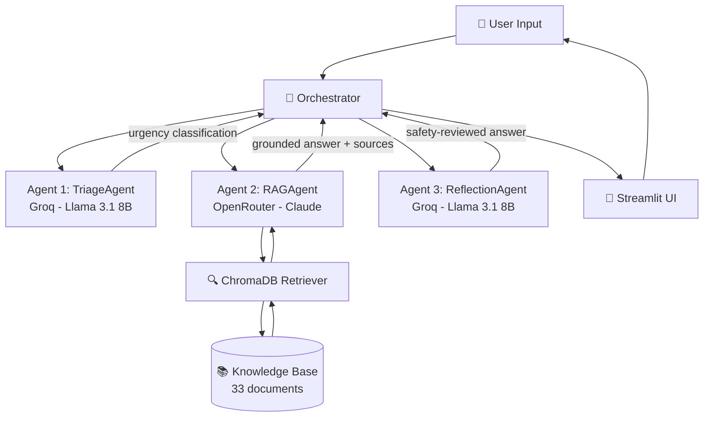
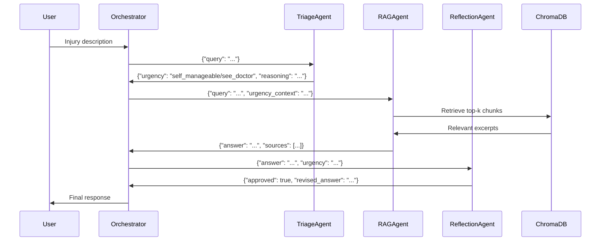

# 🏥 Sports Injury Recovery Assistant

> **University Assignment — Agentic RAG System demonstrating multi-agent orchestration, agent-to-agent communication, and Retrieval-Augmented Generation (RAG) for sports medicine first aid.**

An agentic RAG-based AI assistant that provides grounded, evidence-based first-aid and recovery
guidance for common sports and karate injuries. Built for IT41043 (Agentic AI).

---

## 🌐 Live Demo
**[Try it here](https://sports-injury-assistant.streamlit.app)** <!-- TODO: replace after deploying -->

---

## 📋 Project Description

The Sports Injury Recovery Assistant addresses a real problem faced by athletes and martial
artists (including karate practitioners): getting quick, reliable first-aid guidance for common
training injuries before deciding whether professional medical care is needed. A user describes an
injury or symptom in natural language; the system routes the query through a three-agent pipeline
that triages urgency, retrieves grounded information from a curated knowledge base of 33 sports
medicine documents, reflects on the answer for medical safety, and returns a cited, responsible
recovery guide.

**Key concepts demonstrated:**
- Agentic AI design patterns (Router, Tool-use/RAG, Reflection)
- Agent-to-agent communication via structured JSON messages
- Multi-model orchestration (Groq + OpenRouter)
- Retrieval-Augmented Generation (RAG) with ChromaDB and sentence-transformers
- Responsible AI: automatic safety review before responses reach the user

**⚠️ Disclaimer:** This tool is for educational purposes only and is not a substitute for
professional medical advice.

---

## ⚙️ Setup Instructions

### 1. Clone the repository
```bash
git clone https://github.com/YOUR_USERNAME/sports-injury-assistant.git
cd sports-injury-assistant
```

### 2. Create and activate a virtual environment
```bash
python -m venv venv
# Windows:
venv\Scripts\activate
# macOS/Linux:
source venv/bin/activate
```

### 3. Install dependencies
```bash
pip install -r requirements.txt
```

### 4. Configure API keys
```bash
cp .env.example .env
# Open .env and fill in your real API keys:
#   GROQ_API_KEY       -> https://console.groq.com/keys
#   OPENROUTER_API_KEY -> https://openrouter.ai/keys
```

### 5. Run the RAG ingestion pipeline
Documents are already included in `/data` (33 sports injury reference documents). Run:
```bash
python rag/ingest.py
```
This downloads the embedding model (once), chunks the documents, and stores them in ChromaDB.

### 6. Run the Streamlit app
```bash
streamlit run app.py
```
Open [http://localhost:8501](http://localhost:8501) in your browser.

---

## 🏗️ Architecture Diagram



---

## 🤖 Agent Summary & Model-Choice Comparison

| Agent | Model | Provider | Why This Model? | Pattern |
|---|---|---|---|---|
| **TriageAgent** | `llama-3.1-8b-instant` | Groq | Ultra-fast inference (<1s). Simple categorical classification needs speed, not depth. Free tier available. | Router |
| **RAGAgent** | `anthropic/claude-3-haiku` | OpenRouter | Higher reasoning quality needed to synthesize multiple retrieved chunks into a coherent, cited answer. Larger context window handles multiple excerpts at once. | Tool-use / RAG |
| **ReflectionAgent** | `llama-3.1-8b-instant` | Groq | Fast, cheap safety review — doesn't need deep reasoning, just needs to check the answer aligns with the triage urgency level. Keeps total pipeline latency low. | Reflection |

**Cost / Latency / Context comparison:**

| Model | Latency | Cost per 1M tokens (approx.) | Context Window | Reasoning Quality |
|---|---|---|---|---|
| Llama 3.1 8B (Groq) | Very Low (~200-400ms) | ~$0.05-0.10 | 128K | Adequate for classification |
| Claude Haiku (OpenRouter) | Moderate (~1-3s) | ~$0.25-1.25 | 200K | High — needed for synthesis |

**Groq** is used for the "fast" agents because its LPU hardware gives sub-second latency at very
low cost — ideal for classification and review tasks. **OpenRouter** is used for the RAGAgent
because it provides access to frontier models through a single OpenAI-compatible API, without
managing multiple provider accounts. This mirrors real-world agentic system design: cheap/fast
models handle high-frequency, low-complexity sub-tasks, while a higher-quality model is reserved
for the one step that most affects output quality (final answer synthesis).

---

## 🔄 Agent Communication Sequence



---

## 📚 RAG Pipeline Explanation

### Knowledge Base
33 curated documents covering RICE/PRICE protocol, ankle injuries, wrist/hand/finger injuries,
shoulder injuries, knee injuries, martial arts-specific injuries, football injuries, nasal/facial
injuries, and general first-aid guidelines. Sources include trusted health organizations (Mayo
Clinic, Cleveland Clinic, NHS, Yale Medicine, WebMD).

### Chunking Strategy
Documents are chunked using a heading/paragraph-aware approach, with chunks of approximately
300-500 tokens and slight overlap between adjacent chunks. This preserves semantic coherence
(e.g. a full explanation of a recovery timeline stays in one chunk) rather than cutting text at
arbitrary character counts.

### Embedding Model
Chunks are embedded using `sentence-transformers` (`all-MiniLM-L6-v2`), a lightweight, free,
locally-run model producing 384-dimensional dense vectors. It runs entirely offline with no API
key required, keeping the ingestion pipeline fast and zero-cost.

### Vector Store
[ChromaDB](https://www.trychroma.com/) is used as a persistent local vector store. It requires no
external server, persists data to disk automatically, and supports fast top-k cosine-similarity
search at query time. Re-running ingestion is safe (upsert avoids duplicates).

### Retrieval Flow
```
user_query → SentenceTransformer.encode() → ChromaDB.query() (top-k=4) → retrieved chunks → RAGAgent
```

---

## 🔍 Retrieval Evaluation (5 Sample Queries)

| # | Query | Retrieved Context Relevant? | Comments |
|---|---|---|---|
| 1 | "I sprained my ankle during sparring, it's swollen and bruised" | ✅ Yes | Retrieved `ankle_sprain_grades.txt` and `rice_protocol_overview.txt` — directly relevant, answer cited grade classification and RICE steps accurately |
| 2 | "Hard punch to face, nose bleeding, feels crooked" | ✅ Yes | Retrieved `nasal_injury_blocking_firstaid.txt` and `nasal_fracture_signs.txt` — correctly triggered "see a doctor" classification |
| 3 | "Knee aching for a week after long training, no swelling" | ✅ Yes | Retrieved `runners_knee_treatment.txt` — correctly distinguished overuse injury (patellofemoral pain) from acute injury, cited 4-12 week recovery timeline |
| 4 | "Muscle cramp in my calf during a match" | ✅ Yes | Retrieved `muscle_cramp_treatment.txt` — relevant, practical guidance returned |
| 5 | "Shoulder hurts after throwing a ball repeatedly" | ✅ Yes | Retrieved `shoulder_overuse_injury.txt` and `rotator_cuff_injury.txt` — correctly identified as overuse rather than acute injury |

**Overall observation:** Retrieval quality is consistently high because the knowledge base is
narrowly scoped (sports injuries only) with clearly-differentiated document topics. The main
limitation observed is that very vague queries (e.g. "it hurts") retrieve broader, less-specific
chunks.

---

## ⚠️ Known Limitations

1. **Knowledge base depth**: The system can only answer questions about topics covered in the 33
   ingested documents. Questions well outside this scope receive more generic answers.
2. **No memory / conversation history**: Each query is processed independently; agents do not
   remember previous turns in the session.
3. **Triage is probabilistic**: The TriageAgent uses an LLM for classification, so edge cases may
   be misclassified. The system defaults to "see doctor" on API errors as a safety measure.
4. **Not a medical device**: This application is for educational demonstration only. It has not
   been clinically validated and must not be used for real medical decision-making.
5. **API rate limits**: Both Groq and OpenRouter have rate limits on free tiers; requests may be
   throttled under heavy usage.
6. **RAG hallucination risk**: While the RAGAgent is instructed to only use retrieved chunks, LLMs
   can still generate content not present in the sources. The ReflectionAgent adds a safety layer
   but cannot guarantee complete accuracy.
7. **Embedding model limitations**: `all-MiniLM-L6-v2` is optimised for general English text;
   highly technical medical terminology may not retrieve as precisely as a domain-specific
   biomedical embedding model would.

---

## 📁 Project Structure

```
sports-injury-assistant/
├── agents/
│   ├── __init__.py
│   ├── triage_agent.py       # TriageAgent (Groq) — Router pattern
│   ├── rag_agent.py          # RAGAgent (OpenRouter) — Tool-use/RAG pattern
│   └── reflection_agent.py   # ReflectionAgent (Groq) — Reflection pattern
├── rag/
│   ├── __init__.py
│   ├── ingest.py             # Reads /data docs → chunks → ChromaDB
│   └── retriever.py          # retrieve(query) tool called by RAGAgent
├── data/                     # 33 sports injury reference documents
├── chroma_db/                # Auto-created by ingest.py (git-ignored)
├── orchestrator.py           # Sequential agent pipeline + message passing
├── app.py                    # Streamlit web UI
├── .env                      # Real API keys (git-ignored)
├── .env.example               # Template — copy this to .env
├── .gitignore
├── requirements.txt
└── README.md
```

---

## 🛠️ Tools & Development Disclosure

**Core Technologies:**
- Python 3.12
- Streamlit — web application framework
- ChromaDB — vector database for RAG
- sentence-transformers (all-MiniLM-L6-v2) — embedding model
- Groq API — fast LLM inference (Llama 3.1 8B)
- OpenRouter API — access to Claude models
- Git & GitHub — version control

All architectural decisions (agent design, model selection, RAG pipeline structure) were made by 
me. AI tools were used to accelerate code implementation; all resulting code was reviewed, tested, 
and is fully understood and explainable by me.